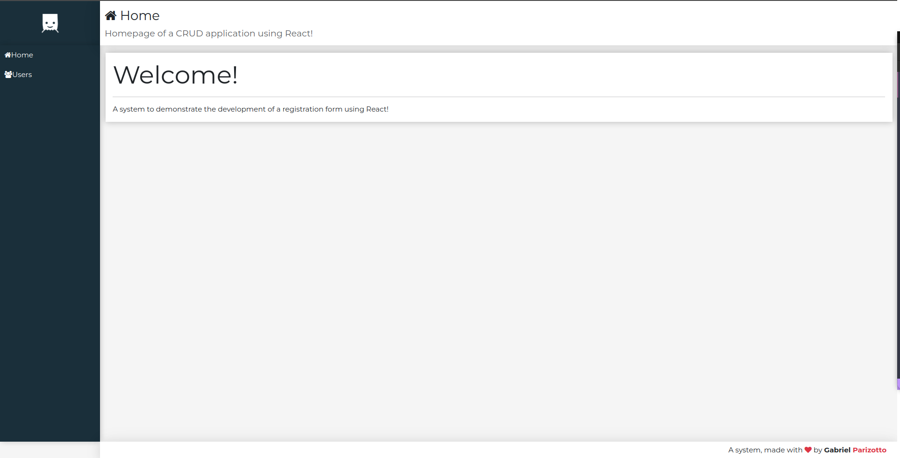
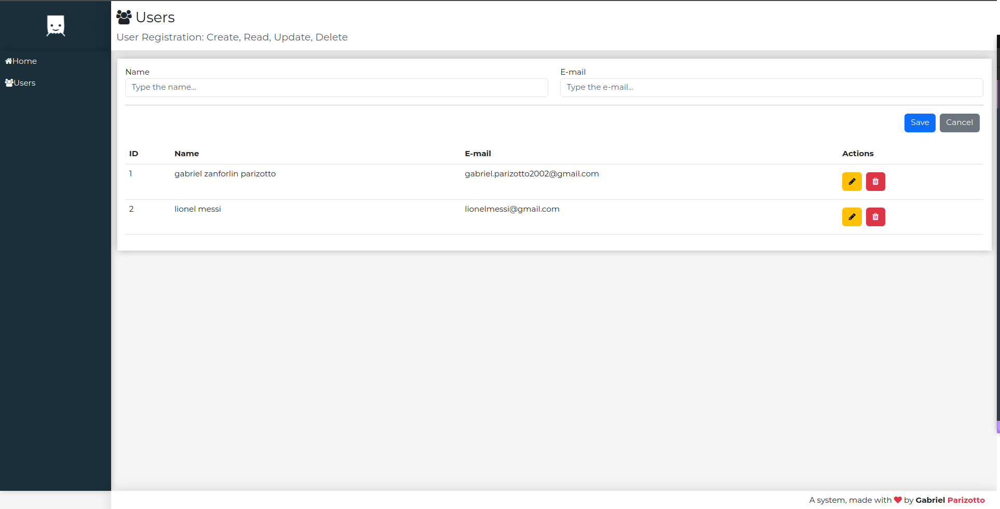

# Login Application Using React!

## Welcome 👋




## Run the application

**Clone the repository**
```bash
git clone https://github.com/gparizotto/login-react.git
```
**Go into the directory**
```
cd login-react
```
**Install the dependencies**
```
npm install
```
** To run the backend, go into the backend folder and run 'npm start'
```
cd backend
npm start
```

**On another terminal, leave the backend folder and go into the frontend folder and run 'npm start'**
```
cd ..
cd frontend
npm start
```

Now you are able to acess the application on <ins>localhost:3000<ins>

## Backend
The backend acts as a server using json-server, constantly monitoring incoming HTTP requests and performing database operations. These operations are applied to a database represented by a .json file named db.json, which contains user names and email addresses. Requests are sent from the frontend's UserCrud.jsx, triggered by user interactions with buttons such as 'Users' (to load all users), 'Edit' (to modify name or email), or 'Save' (to add a new user to the database).

## Frontend
The frontend is basically loaded on app.jsx, which contains the logo, header, nav, footer and router components displayed on a grid layout. The router component display the main pages: home and users. The users page acesses the database and display all users registered.

## Contribute 📫 

The frontend is primarily loaded through app.jsx, which includes components such as the logo, header, navigation, footer, and router. These components are arranged within a grid layout. The router component is responsible for rendering the main pages, including 'home' and 'users.' The 'users' page interacts with the database to display all registered users.

**Clone the repository**
```bash
git clone https://github.com/gparizotto/login-react.git
```
**Create a new Branch with a new feature**
```
git checkout -b feature/NAME
```
**Commit the changes**
```
git commit -m "Feat: new feat added"
```
**Push the branch to github**
```
git push -u origin feature/NAME
```

**Follow commit patterns**

**Open a Pull Request explaining the problem solved or feature made, if exists, append screenshot of visual modifications and wait for the review!**
